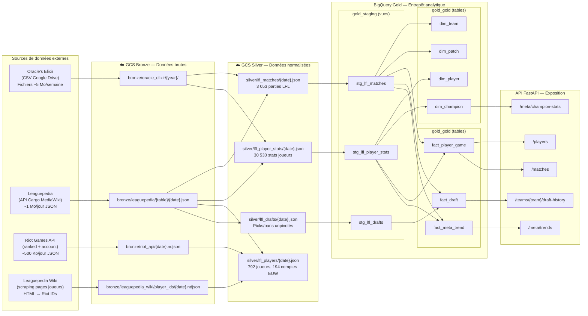
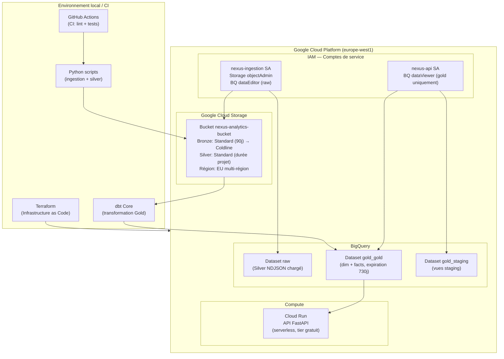
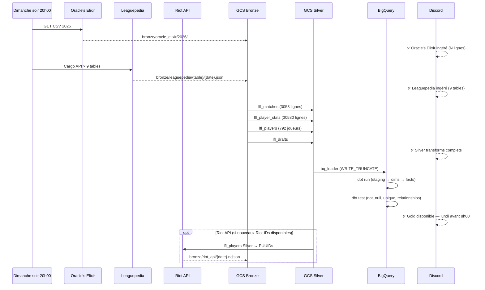

# Architecture technique — Nexus Analytics

> Schéma formel d'architecture du datalake Nexus Analytics.
> Répond au critère C18 (conception architecture datalake) du référentiel RNCP.
>
> Dernière mise à jour : 2026-07-09

---

## 1. Vue d'ensemble — Architecture Medallion (datalake 3 couches)



---

## 2. Vue applicative — Matrice des flux

| Flux | Source | Destination | Fréquence | Volume estimé | Format | Déclencheur |
|------|--------|-------------|-----------|--------------|--------|------------|
| Ingestion Oracle's Elixir | oracleselixir.com (Google Drive) | GCS Bronze | Hebdomadaire | ~5 Mo/CSV | CSV | Manuel (dim. 20h00) |
| Ingestion Leaguepedia | lol.fandom.com API Cargo | GCS Bronze | Hebdomadaire | ~1 Mo/table/jour | NDJSON | Manuel (dim. 20h00) |
| Ingestion Riot API | developer.riotgames.com | GCS Bronze | Hebdomadaire | ~500 Ko/jour | NDJSON | Après Silver lfl_players |
| Ingestion wiki scraping | lol.fandom.com pages | GCS Bronze | Mensuel | ~200 Ko | NDJSON | Manuel |
| Normalisation Silver | GCS Bronze | GCS Silver | Hebdomadaire | ~2 Mo/Parquet | NDJSON | Après ingestion |
| Chargement Silver→Gold | GCS Silver | BigQuery raw | Hebdomadaire | ~1 Mo/semaine | BQ tables | Après normalisation Silver |
| Transformation dbt | BigQuery raw | BigQuery Gold | Hebdomadaire | ~500 Ko nouvelles lignes | BQ views/tables | Après chargement Silver→Gold |
| Requêtes analytiques | BigQuery Gold | API FastAPI → Analyste | À la demande | < 1 Go scanné/req | JSON/HTTP | Appel HTTP analyste |
| Alertes pipeline | GitHub Actions / Python | Discord webhook | Sur erreur | Minimal | Text | Échec job ou données non disponibles avant 10h lundi |

---

## 3. Vue infrastructure — Représentation GCP



---

## 4. Vue opérationnelle — Pipeline hebdomadaire



---

## 5. Justification des choix techniques

### Pourquoi GCS comme couche Bronze/Silver ?

GCS est le stockage objet natif GCP, avec intégration directe BigQuery (`load_table_from_uri`). Le stockage objet est adapté à des fichiers NDJSON non structurés de quelques Mo. La facturation est à l'usage (~0,10€/mois pour 5 Go). Terraform permet de gérer les lifecycle policies (transition Coldline) comme code versionné.

### Pourquoi le pattern Medallion ?

La séparation Bronze/Silver/Gold garantit la traçabilité complète (chaque donnée Gold est retrouvable jusqu'à son fichier Bronze source). En cas d'erreur dans la normalisation Silver, on peut recalculer sans réingérer depuis les APIs externes. Ce pattern est devenu un standard de l'industrie du datalake (Databricks Medallion Architecture, Delta Lake).

### Pourquoi pas de streaming ?

Les données LFL sont publiées après chaque journée de compétition. Il n'existe pas de besoin temps réel chez Nexus Analytics. Un pipeline batch hebdomadaire consomme plusieurs ordres de grandeur d'énergie de moins qu'un pipeline streaming pour le même résultat analytique (choix éco-responsable conforme au RGESN 2024).

### Pourquoi pas un catalogue de données outillé ?

Trois outils ont été évalués avant de choisir l'approche catalogue retenue.

#### Comparatif outils catalogue

| Critère | Google Cloud Dataplex | OpenMetadata | dbt docs + DATA_CATALOG.md *(retenu)* |
|---------|----------------------|--------------|---------------------------------------|
| **Intégration GCS + BigQuery** | Native — scan automatique des assets GCS et BQ | Via connecteurs configurables (non natif) | dbt couvre BigQuery Gold ; DATA_CATALOG.md couvre GCS Bronze/Silver |
| **Lineage automatique** | Oui — détecte les dépendances entre ressources GCP | Oui — lineage multi-sources | Oui dans dbt (`dbt docs serve` génère le DAG) ; lineage GCS → BQ documenté manuellement dans DATA_CATALOG.md |
| **Installation** | Managed GCP — activable en 5 min via Terraform | Self-hosted — Docker/Kubernetes requis | Aucune infrastructure supplémentaire — dbt déjà en place |
| **Coût mensuel** | ~15–50€/mois selon volume scanné (pricing à l'asset) | 0€ (open source) + coût infra serveur (~20€/mois min) | 0€ — dbt Core gratuit, DATA_CATALOG.md statique |
| **Gouvernance / RGPD** | Tags de sensibilité GCP (PII tagging), DLP intégré | Politiques de données, classification custom | Classification manuelle dans DATA_CATALOG.md (tableau RGPD par colonne) |
| **Adapté projet mono-équipe** | Surdimensionné — conçu pour des dizaines de datasets | Surdimensionné — conçu pour des équipes data | Adapté — un fichier markdown + `dbt docs serve` |
| **Courbe d'apprentissage** | Faible (interface GCP) | Élevée (configuration API, connecteurs, auth) | Nulle — déjà maîtrisé |
| **Mise à jour catalogue** | Automatique (scan planifié) | Semi-automatique (connecteurs) | Manuelle (DATA_CATALOG.md) + automatique pour Gold (dbt docs) |

#### Décision et justification

**Outil retenu : `dbt docs` (Gold) + `docs/DATA_CATALOG.md` (Bronze/Silver)**

Raisons :

1. **Volume et périmètre** : 4 sources, 11 modèles dbt, 1 équipe. Google Dataplex et OpenMetadata sont conçus pour des centaines de datasets et des équipes multi-profils — leur coût opérationnel (humain et financier) dépasse la valeur apportée.

2. **Coût** : le budget Nexus Analytics est de 8€/mois réel vs 300€ alloué. Ajouter Dataplex ajouterait 15–50€/mois pour un gain marginal sur ce périmètre.

3. **Intégration dbt** : `dbt docs serve` génère automatiquement un catalogue interactif de la couche Gold (schémas, descriptions, tests, DAG de lignée) depuis les fichiers `schema.yml` déjà écrits. Ce catalogue est fonctionnel sans configuration supplémentaire.

4. **Couverture Bronze/Silver** : `docs/DATA_CATALOG.md` documente statiquement les 6 sources Bronze et 4 tables Silver avec schéma, volume, classification RGPD et lignée. Mise à jour manuelle à chaque ajout de source.

5. **Évolutivité** : si le projet s'étend à de nouvelles équipes ou à 50+ tables, **Google Cloud Dataplex** serait l'outil recommandé — intégration GCS/BigQuery native, PII tagging automatique, lifecycle management. La migration serait facilitée par la structure déjà en place (metadata GCS, schema.yml dbt).

#### Commande pour générer le catalogue Gold interactif

```bash
cd dbt
uv run --with dbt-bigquery dbt docs generate --project-dir . --profiles-dir .
uv run --with dbt-bigquery dbt docs serve --project-dir . --profiles-dir .
# http://localhost:8080 — DAG interactif + schémas + descriptions + tests
```
