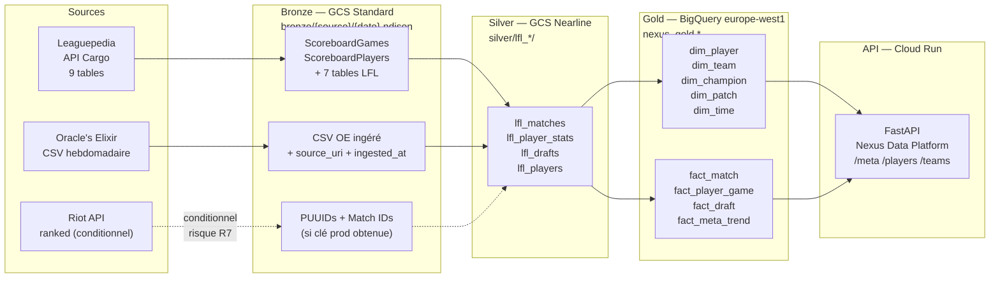
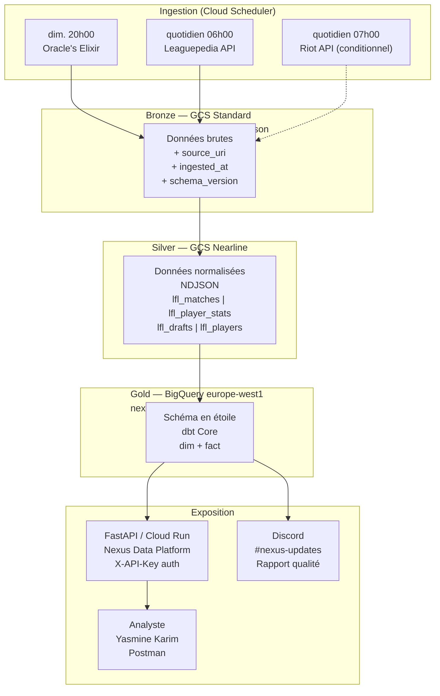
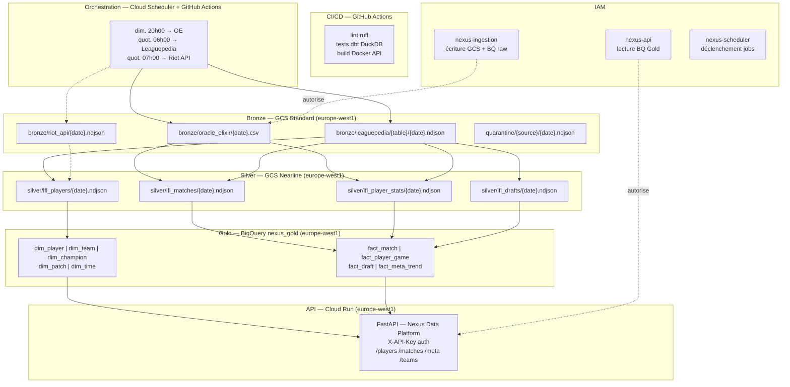
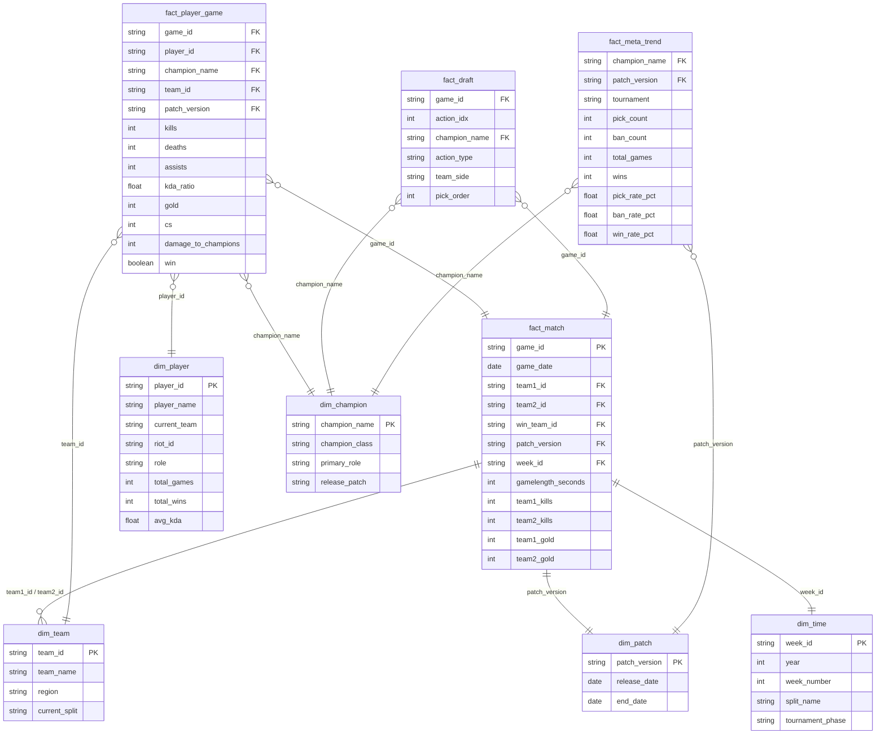

# RNCP37638 — Expert en infrastructures de données massives
## Bloc de compétences BC01 — Piloter la conduite d'un projet data
### Rapport professionnel individuel

**Infrastructure de données compétitives League of Legends — Nexus Analytics**

| Champ | Valeur |
|-------|--------|
| **Candidat** | Antoine MLD, Data Engineer consultant |
| **Commanditaire** | Marc Delacroix, Co-fondateur et Directeur général, Nexus Analytics |
| **Mission** | Conception et déploiement d'une infrastructure de données pour l'automatisation de la production des rapports d'analyse compétitive |
| **Date** | Juillet 2026 |
| **Statut** | Document produit dans le cadre de l'évaluation E2 du bloc BC01 — RNCP37638. Commanditaire fictif, données de marché sourcées. |

---

## Sommaire

1. Introduction : contexte, enjeux et reformulation du besoin
2. Objectifs et périmètre fonctionnel du projet
   - 2.1 Objectifs SMART
   - 2.2 Périmètre fonctionnel inclus
   - 2.3 Cartographie des données
   - 2.4 Périmètre fonctionnel exclu (Won't Have — MoSCoW)
3. Étude d'opportunités
   - 3.1 Synthèse des entretiens métier
   - 3.2 Benchmark des outils, plateformes et services disponibles
4. Étude de faisabilité
   - 4.1 Architecture technique retenue et justification des choix
   - 4.2 Matrice des flux de données
   - 4.3 Qualité des données
   - 4.4 Conformité RGPD
   - 4.5 Éco-responsabilité
   - 4.6 Coûts, délais et moyens
   - 4.7 Accessibilité des livrables
   - 4.8 Veille technique et réglementaire
5. Conclusions et recommandation de cadrage
   - 5.1 Analyse RICE
   - 5.2 Recommandation de cadrage
   - 5.3 Conclusion

**Annexes**
- Annexe 1 — Architecture technique et infrastructure GCP
- Annexe 2 — Modèle de données Gold (schéma en étoile)
- Annexe 3 — Plan de communication et rituels du projet
- Annexe 4 — Registre des traitements RGPD
- Annexe 5 — Lettre de mission

---

## 1. Introduction

### 1.1 Contexte de la mission

Je suis data engineer consultant, missionné par Nexus Analytics en mai 2026 pour concevoir et déployer une infrastructure de données adaptée à leurs besoins opérationnels. Nexus Analytics est un cabinet de conseil en performance compétitive spécialisé dans League of Legends, fondé il y a dix-huit mois par Marc Delacroix, ancien analyste performance dans une équipe de la Ligue Française de League of Legends (LFL). La structure accompagne quatre équipes clientes — deux équipes LFL, une équipe EMEA Masters, et une académie préparant des joueurs au circuit professionnel — en leur livrant des rapports hebdomadaires de préparation de matchs, d'analyse méta et de scouting d'adversaires.

League of Legends est un jeu vidéo compétitif édité par Riot Games, structuré en ligues professionnelles régionales dont la LEC (League of Legends EMEA Championship) représente l'échelon européen maximal et la LFL son équivalent français de deuxième division. Ces compétitions génèrent des données de match volumineuses — positions de joueurs, indicateurs économiques en jeu, compositions d'équipes — qui constituent la matière première du conseil en performance compétitive.

### 1.2 Enjeux du projet

Le marché du conseil en analyse esport est en structuration rapide. Team Liquid, organisation esport professionnelle de 300 employés, a documenté publiquement avec SAP la problématique centrale de ce secteur : l'analyse de performance reposait sur du travail entièrement manuel, représentant 250 000 dollars d'économies annuelles une fois automatisée, sur la base de 1,6 terabyte de données historiques couvrant plus de dix millions de parties analysées. Source : SAP customer story officielle (sap.com, mise à jour mai 2025). Team Liquid est une grande organisation avec un partenariat SAP — son cas illustre le besoin mais ne représente pas la réalité de Nexus Analytics. Ce qui est pertinent, c'est la nature du problème : le déséquilibre entre temps consacré à la collecte manuelle de données et temps consacré à l'analyse à valeur ajoutée est un problème structurel qui se pose à toutes les échelles de l'écosystème.

Côté infrastructure de données, le marché s'est récemment consolidé autour d'un acteur unique. GRID, une startup berlinoise, est depuis décembre 2023 le distributeur officiel exclusif des données compétitives LoL en vertu d'un partenariat multi-années avec Riot Games couvrant la LEC, les ERLs et l'EMEA Masters. Source : SportVideo.org, 4 décembre 2023. En mai 2025, Bayes Esports — qui assurait précédemment ce rôle — a fait faillite, et GRID a racheté ses actifs en septembre 2025. Source : Yogonet International, 24 septembre 2025. Ce service est commercial et orienté bookmakers, diffuseurs et grandes organisations, inaccessible pour une structure comme Nexus Analytics.

C'est dans ce contexte — besoin documenté, données publiques disponibles mais sans infrastructure, solutions commerciales hors budget — que Nexus Analytics m'a confié cette mission.

### 1.3 Reformulation du besoin initial

La demande initiale de Marc Delacroix, telle qu'il me l'a formulée lors de notre premier entretien le 12 mai 2026, était la suivante : réduire le temps que ses analystes passent à collecter et mettre en forme des données et leur permettre de se concentrer sur la production d'analyses.

La reformulation que je soumets au commanditaire est la suivante : concevoir et déployer une infrastructure de données automatisée qui ingère hebdomadairement les données compétitives League of Legends disponibles publiquement (Oracle's Elixir, Leaguepedia API, Riot API sous conditions — voir §4.4), les normalise, les modélise dans un entrepôt analytique structuré, et les expose via une API interne permettant à l'analyste de produire ses rapports sans manipulation manuelle de fichiers, dans le cadre d'un usage interne à usage limité respectant les conditions d'utilisation de chaque source.

---

## 2. Objectifs et périmètre fonctionnel du projet

### 2.1 Objectifs SMART

Quatre objectifs structurent ce projet, rédigés selon la méthode SMART. Ces objectifs ont été co-construits et validés lors des entretiens des 12, 14 et 16 mai 2026 (voir Annexe 3 — Plan de communication, réunion de lancement S1).

| Objectif | Formulation SMART |
|----------|------------------|
| **O1 — Automatisation de l'ingestion** | Mettre en place un pipeline automatisé qui ingère les données Oracle's Elixir et Leaguepedia dans un délai inférieur à deux heures suivant leur publication, sans intervention manuelle, **avant le 30 septembre 2026**. — *Spécifique* : pipeline Bronze GCS alimenté par Oracle's Elixir CSV + API Leaguepedia Cargo. — *Mesurable* : délai d'ingestion < 2h, zéro téléchargement manuel pendant 4 semaines consécutives. — *Acceptable* : validé par Yasmine Karim (entretien du 14 mai 2026). — *Réaliste* : sources publiques accessibles, faisabilité technique établie. — *Temporellement défini* : 30 septembre 2026. |
| **O2 — Réduction du temps de collecte** | Ramener le temps hebdomadaire de l'analyste consacré à la collecte et à la mise en forme des données de deux jours (estimation Yasmine Karim, 14 mai 2026) à moins de trente minutes, **avant le 31 octobre 2026**. — *Mesurable* : temps mesuré par l'analyste sur quatre semaines consécutives après mise en production. — *Réaliste* : normalisation Silver et modèles dbt éliminent les manipulations Excel. |
| **O3 — Traçabilité complète** | Garantir que 100% des données utilisées dans les rapports sont traçables jusqu'à leur source et leur date d'ingestion, **avant le 30 septembre 2026**. — *Spécifique* : métadonnée `source_uri` et `ingested_at` sur chaque objet GCS Bronze. — *Mesurable* : audit aléatoire de 10 données dans un rapport — 100% doivent être retrouvables dans les logs d'ingestion. |
| **O4 — Disponibilité garantie** | Garantir que les données de la semaine en cours sont disponibles dans BigQuery chaque lundi avant 8h00, avec un taux de réussite d'au moins 95% sur trois mois glissants, **avant le 30 novembre 2026**. — *Mesurable* : timestamp de disponibilité dans BigQuery, taux calculé sur 13 semaines glissantes. |

### 2.2 Périmètre fonctionnel inclus

Le projet couvre les éléments suivants, issus de la synthèse des entretiens métier conduits entre le 12 et le 16 mai 2026 et confirmés par le commanditaire lors de la réunion de lancement. Les grilles d'entretien complètes constituent le livrable E1 associé à ce rapport.

- **L'ingestion automatisée** depuis trois sources : Oracle's Elixir (statistiques de matchs pro en CSV depuis 2014, réutilisation libre — voir §4.4 pour les conditions), l'API Leaguepedia (historique de drafts, résultats, équipes, joueurs via tables Cargo MediaWiki, licence CC BY-SA 3.0 — attribution requise dans les livrables clients), et l'API Riot Games ranked (PUUIDs et statistiques de soloqueue — sous réserve d'obtention d'une clé de production, voir risque R7 en §4.6).
- **La normalisation et le dédoublonnage** dans une zone Silver avec standardisation des noms d'équipes et traçabilité complète.
- **La modélisation dimensionnelle** dans un entrepôt analytique BigQuery (zone Gold), en schéma en étoile avec dbt Core.
- **L'exposition des données** via une API REST interne FastAPI (Nexus Data Platform) déployée sur Cloud Run.
- **L'infrastructure as code Terraform** et le pipeline CI/CD GitHub Actions.

### 2.3 Cartographie des données

#### 2.3.1 Sémantique — Glossaire métier

Le glossaire métier complet est maintenu dans `docs/GLOSSAIRE_METIER.md` du dépôt Git. Extrait des termes fondamentaux par domaine :

**Domaine jeu (League of Legends)**

| Terme | Définition |
|-------|-----------|
| **Champion** | Personnage jouable. Plus de 160 champions. Chaque joueur en sélectionne un par partie. |
| **Patch** | Version du jeu publiée toutes les deux semaines environ. Modifie l'équilibre des champions. Format : `14.5` = saison 14, patch n°5. |
| **Méta** | Ensemble des stratégies et champions optimaux sur un patch donné. Change à chaque patch. |
| **Pick / Ban** | Phase de draft avant la partie. Chaque équipe ban 5 champions et sélectionne 5 champions. |
| **KDA** | `(kills + assists) / deaths`. Indicateur de performance individuelle. Calculé avec `SAFE_DIVIDE` pour éviter la division par zéro. |
| **OverviewPage** | Identifiant unique d'une compétition sur Leaguepedia. Format : `LFL/2025 Season/Spring Split`. Clé de jointure primaire entre toutes les tables Leaguepedia. |

**Domaine identifiants techniques**

| Terme | Définition |
|-------|-----------|
| **PUUID** | Player Universally Unique Identifier. Identifiant pseudonymisé attribué par Riot Games. 78 caractères. Donnée à caractère personnel. |
| **Riot ID** | Identifiant public d'un compte joueur. Format `gameName#tagLine`. |
| **GameId** | Identifiant unique d'une partie Leaguepedia. Format : `LFL/2025 Season/Spring Split_Day 5_3_2`. |

**Domaine architecture**

| Terme | Définition |
|-------|-----------|
| **Medallion Architecture** | Pattern Bronze (brut) → Silver (nettoyé) → Gold (agrégé). |
| **NDJSON** | Newline Delimited JSON. Format de fichier où chaque ligne est un objet JSON autonome. Compatible BigQuery natif. |
| **SCD Type 1** | Slowly Changing Dimension Type 1 : les changements écrasent l'ancienne valeur. Choix retenu pour `dim_player` et `dim_team`. L'historisation est portée par `fact_player_game` (team_id au moment du match), ce qui rend le SCD1 acceptable sans perte d'information. |
| **Idempotence** | Propriété d'une opération produisant le même résultat qu'elle soit exécutée une ou plusieurs fois. Garantie par `WRITE_TRUNCATE` dans BigQuery. |

#### 2.3.2 Modèles de données — Sources et Gold

**Modèles des données sources**

| Source | Structure | Grain | Colonnes clés | Format |
|--------|-----------|-------|--------------|--------|
| Oracle's Elixir CSV | Tabulaire — 1 fichier par semaine | 1 ligne par joueur × partie (12 lignes par match : 10 joueurs + 2 lignes équipe) | `gameid`, `datacompleteness`, `league`, `split`, `date`, `game`, `participantid`, `side`, `position`, `playername`, `teamname`, `champion`, `kills`, `deaths`, `assists`, `gold`, `cs`, `damagetochampions`, `dpm`, `result` | CSV brut, ~4,8 Mo/semaine en 2026 |
| Leaguepedia ScoreboardGames | Table Cargo MediaWiki | 1 ligne par partie | `OverviewPage`, `Tournament`, `Team1`, `Team2`, `WinTeam`, `DateTime UTC`, `Patch`, `GameId`, `Gamelength`, `Team1Gold`, `Team2Gold`, `Team1Kills`, `Team2Kills` | JSON via API Cargo |
| Leaguepedia ScoreboardPlayers | Table Cargo MediaWiki | 1 ligne par joueur × partie | `OverviewPage`, `Link`, `Champion`, `Kills`, `Deaths`, `Assists`, `Gold`, `CS`, `DamageToChampions`, `PlayerWin`, `DateTime UTC` | JSON via API Cargo |
| Leaguepedia PicksAndBansS7 | Table Cargo MediaWiki | 1 ligne par action de draft | `OverviewPage`, `BluePick1..5`, `RedPick1..5`, `BlueBan1..5`, `RedBan1..5`, `DateTime UTC` | JSON via API Cargo |
| Leaguepedia Players | Table Cargo MediaWiki | 1 ligne par joueur | `ID`, `Player`, `SoloqueueIds`, `Country`, `Role` | JSON via API Cargo |
| Riot API (`account-v1`, `match-v5`) | JSON REST | 1 ligne par joueur (PUUID), 1 ligne par match ranked | `puuid`, `gameName`, `tagLine`, `matchId`, `champion`, `kills`, `deaths`, `assists`, `win` | JSON |

**Modèle Gold — Schéma en étoile** (voir Annexe 2 pour le détail complet)

| Objet | Type | Description |
|-------|------|-------------|
| `dim_player` | Dimension | Joueurs avec Riot ID, équipe courante, stats agrégées |
| `dim_team` | Dimension | Équipes avec `dim_team_alias` pour les variantes de noms |
| `dim_champion` | Dimension | Champions avec stats statiques (Data Dragon) |
| `dim_patch` | Dimension | Patches avec dates de déploiement |
| `dim_time` | Dimension | Calendrier ISO aligné sur le calendrier LFL |
| `fact_match` | Fait | 1 ligne par partie — résultat, durée, kills, gold, objectifs |
| **`fact_player_game`** | **Fait** | **1 ligne par joueur × partie — KDA, gold, CS, damage — grain nativement aligné sur Oracle's Elixir** |
| `fact_draft` | Fait | 1 ligne par action de draft (pick/ban) |
| `fact_meta_trend` | Fait | Agrégation hebdomadaire winrates par champion/patch/tournoi |

#### 2.3.3 Flux de transformation — Architecture Medallion



#### 2.3.4 Conditions d'accès et de mise à disposition

L'accès aux données est gouverné par le principe du moindre privilège. Le compte de service `nexus-api` dispose uniquement des droits `BigQuery Data Viewer` en lecture seule sur le dataset `nexus_gold`. L'analyste (Yasmine Karim) accède aux données exclusivement via les endpoints API — sans accès direct à BigQuery ni aux fichiers GCS. Aucun tiers externe n'a accès aux données.

**Conditions d'utilisation des sources :**

| Source | Licence / CGU | Obligations concrètes |
|--------|--------------|----------------------|
| Oracle's Elixir | Réutilisation libre pour usage analytique (absence de licence formelle explicite — usage largement établi dans la communauté analytique esport). | Mentionner la source dans les rapports clients (`Source : Oracle's Elixir, oracleselixir.com`). Veille active sur toute évolution des conditions. |
| Leaguepedia | CC BY-SA 3.0 | **Attribution obligatoire** dans chaque rapport livré aux clients : `Données compétitives : Leaguepedia (lol.fandom.com), licence CC BY-SA 3.0`. Le share-alike s'applique aux bases de données dérivées ; les rapports d'analyse (œuvre interprétative) en sont probablement exclus, mais la mention d'attribution est systématiquement apposée par précaution. |
| Riot API | Riot Developer Portal — usage personnel/non-commercial | Voir §4.4 (risque juridique identifié et mitigé). |

### 2.4 Périmètre fonctionnel exclu (Won't Have — MoSCoW)

Les éléments suivants ont été classés **Won't Have** dans la priorisation MoSCoW. Cette classification traduit un choix délibéré de périmètre fondé sur les contraintes budgétaires, techniques et temporelles identifiées lors des entretiens — non un manque de valeur de ces fonctionnalités.

- **Données live officielles** (positions, gold, objectifs en temps réel) : distribuées exclusivement par GRID dans le cadre d'un service commercial inaccessible pour Nexus Analytics.
- **Données de scrimmage** : accessibles uniquement via le portail LDP officiel réservé aux organisations partenaires Riot.
- **Dashboard de visualisation** destiné aux équipes clientes : Phase 2, non couverte par ce premier projet. Identifiée comme fonctionnalité F7 dans l'analyse RICE (voir section 5.1) — périmètre et format à cadrer à l'issue de la mise en production.

---

## 3. Étude d'opportunités

### 3.1 Synthèse des entretiens métier

J'ai conduit trois entretiens semi-directifs entre le 12 et le 16 mai 2026. Les grilles d'entretien complètes constituent le livrable E1 associé à ce rapport.

#### Marc Delacroix — Directeur général (entretien du 12 mai 2026)

Marc Delacroix a fondé Nexus Analytics après trois ans passés comme analyste performance dans une équipe LFL. Il accompagne actuellement quatre équipes clientes et leur livre des rapports hebdomadaires en PDF par email.

Le déclencheur du projet est un incident survenu en février 2026. Un rapport de préparation de match a été livré avec des données de méta issues de la semaine S-2 au lieu de la semaine S-1. L'équipe a préparé son adversaire sur une méta périmée et a perdu le match. Thomas Bourgeois a dû offrir un mois de prestation gratuit pour compenser. Marc Delacroix m'a explicitement identifié cet incident comme la révélation d'un problème structurel : le processus repose entièrement sur la vigilance individuelle de l'analyste, sans filet de sécurité automatisé.

Sa vision stratégique : doubler le nombre d'équipes clientes d'ici fin 2026 sans recruter, avec un budget infrastructure de 300€ par mois maximum. Sa méfiance vis-à-vis des fournisseurs tiers (citant la faillite de Bayes Esports en mai 2025) oriente fortement l'architecture vers des sources publiques.

#### Yasmine Karim — Analyste senior (entretien du 14 mai 2026)

Yasmine est l'utilisatrice finale principale. Sa semaine type : téléchargement manuel du CSV Oracle's Elixir (parfois disponible le mardi ou mercredi), correction dans Excel des noms d'équipes variants selon les sources et les saisons, requêtes manuelles sur Leaguepedia pour les compositions de draft, consolidation dans des tableaux Excel.

Deux problèmes récurrents : l'absence de traçabilité (impossible de retrouver l'origine d'un chiffre dans un rapport livré trois mois plus tôt) et l'incohérence entre les sources. Besoins analytiques non satisfaits : tendances de draft régionales (quels champions émergent en LFL avant d'apparaître en LEC ?), filtrage par patch, pick/ban rates et winrates calculés automatiquement.

#### Thomas Bourgeois — Chargé des relations clients (entretien du 16 mai 2026)

Les équipes LFL ont des semaines de compétition le lundi et le mardi et attendent les rapports au plus tard le dimanche soir. Une équipe fait ses propres analyses en parallèle directement sur Leaguepedia, faute de confiance dans la fraîcheur des données de Nexus Analytics. Demande émergente : une analyse flash en moins de deux heures quand l'adversaire change au dernier moment — aujourd'hui impossible, faisable en moins d'une heure avec l'infrastructure proposée.

#### Convergences transversales

Trois besoins convergent dans les trois entretiens : **la fiabilité de la donnée** (Marc : risque client, Yasmine : traçabilité, Thomas : confiance client), **la disponibilité en temps voulu** (avant les semaines de compétition, sans travail le week-end, avec délai de livraison garanti), et **la capacité d'analyse à plus grande échelle** (onboarding nouveaux clients, analyses plus riches, analyses flash).

### 3.2 Benchmark des outils, plateformes et services disponibles

| Solution / Catégorie | Ce que ça couvre | Limites pour Nexus Analytics | Budget | Verdict |
|---------------------|-----------------|------------------------------|--------|---------|
| **Oracle's Elixir** — site web et CSV (oracleselixir.com) | Stats matchs pro mondiaux depuis 2014. CSV libres. Géré par Tim Sevenhuysen, analyste indépendant. | Pas d'API. Téléchargement manuel uniquement. Publication non garantie le lundi. CSV sans métadonnées. Risque projet solo. | Gratuit | Source à intégrer dans le pipeline. |
| **Leaguepedia** — wiki collaboratif et API Cargo (lol.fandom.com) | Historique compétitif complet : drafts, résultats, équipes, joueurs. API Cargo publique, gratuite. CC BY-SA 3.0. | Pas de pipeline automatisé côté consommateur. Pas de stats K/D/A/gold. Noms incohérents avec Oracle's Elixir. | Gratuit | Source complémentaire à intégrer. |
| **GRID** — plateforme de données esport (grid.gg) | Données live et post-match LEC, ERLs. Partenaire exclusif Riot depuis déc. 2023 (sportsvideo.org). API unifiée multi-titres. | Service commercial exclusivement. Orienté bookmakers et diffuseurs. Inaccessible pour une structure de 3 personnes. | Non public / hors budget | Hors périmètre. Illustration parfaite du risque de dépendance (faillite Bayes Esports mai 2025 → rachat GRID sept. 2025 : yogonet.com). |
| **Mobalytics** — analytics gaming (ESL FACEIT Group) | Analytics gaming joueurs individuels. Rachat ESL FACEIT Group mars 2025 (cbinsights.com). | Périmètre différent : joueurs individuels, pas équipes pro. Pas de données LFL. Pas d'API d'export. | Freemium (~10€/mois) | Hors périmètre. |
| **Outils communautaires** (ProComps.gg, LolDraftAI, Draftedlol) | Aide au draft en ranked. Synergies, contre-picks. | Pas de données LFL pro. Pas d'API ni d'export. Conçus pour consultation humaine, pas production de rapports. | Gratuit / Freemium | Hors périmètre. |
| **Nexus Data Platform** — solution sur mesure (ce projet) | Pipeline automatisé Oracle's Elixir + Leaguepedia + Riot API. Architecture Medallion sur GCP. API FastAPI interne. Traçabilité complète. | Pas de données live officielles. Dépendance Oracle's Elixir (projet solo). Riot API sous réserve d'obtention de clé de production. | ~8€/mois (infra seule) | Seule solution répondant aux quatre critères : couverture LFL, automatisation, modélisation analytique, budget compatible. |

Le benchmark confirme qu'aucune solution existante ne répond simultanément aux contraintes de Nexus Analytics. Le gap est réel et documenté. Cette analyse comparative sert de fondation à la section 4.1 qui détaille les choix architecturaux et leur justification au regard des alternatives identifiées ici.

---

## 4. Étude de faisabilité

### 4.1 Architecture technique retenue et justification des choix

#### Analyse fonctionnelle

> Le système Nexus Data Platform doit ingérer hebdomadairement des données compétitives League of Legends depuis des sources publiques, les normaliser et les modéliser dans un entrepôt analytique, et les exposer via une API REST interne.

**Contraintes métier** :
- Les rapports clients doivent être livrés le dimanche soir, pour des matchs joués le lundi et le mardi.
- Les données Oracle's Elixir sont publiées au plus tôt le dimanche soir (risque de publication tardive documenté).
- Budget infrastructure : 300€/mois maximum (Marc Delacroix, entretien du 12 mai 2026).
- Pas de dépendance à un fournisseur commercial externe (méfiance documentée suite à la faillite Bayes Esports).
- Usage interne à usage limité, respectant les CGU de chaque source.

**Besoins non-fonctionnels**

| Catégorie | Exigence | Mesure / Source |
|-----------|----------|----------------|
| **Disponibilité** | Données disponibles dans BigQuery chaque lundi avant 8h00 à 95% (O4) | Timestamp de disponibilité, taux sur 13 semaines |
| **Performance** | Délai d'ingestion < 2h après publication Oracle's Elixir (O1) | Horodatage ingestion vs publication |
| **Budget** | Infrastructure < 300€/mois (Marc Delacroix) | Factures GCP mensuelles |
| **Traçabilité** | 100% des données auditables jusqu'à leur source (O3) | `source_uri` + `ingested_at` sur chaque objet GCS |
| **Conformité** | RGPD — données personnelles pseudonymisées traitées en UE | Registre des traitements (Annexe 4) |
| **Sécurité** | Accès aux données via compte de service IAM moindre privilège | Pas d'accès direct BigQuery pour les utilisateurs finaux |
| **Reproductibilité** | Infrastructure entièrement reproductible depuis un dépôt Git | Terraform + GitHub Actions |
| **Éco-responsabilité** | Architecture serverless, batch hebdomadaire, région à faible intensité carbone | RGESN 2024 (voir §4.5) |

#### Architecture Medallion

L'architecture retenue s'appuie sur le pattern Medallion (Bronze → Silver → Gold), standard de l'industrie pour les data lakehouses. Le schéma complet figure en Annexe 1.



**Zone Bronze — Google Cloud Storage Standard**

Les données brutes de chaque source sont ingérées dans GCS avec leurs métadonnées d'ingestion : `source_uri`, `ingested_at`, `schema_version`, URI de l'objet GCS. Ces métadonnées répondent directement au problème de traçabilité identifié lors des entretiens et à la cause racine de l'incident de février 2026. La stratégie de classes de stockage optimise les coûts : données courantes en Standard, données plus anciennes en Nearline (0,010$/Go/mois). Source tarifaire : cloud.google.com/storage/pricing (juillet 2026).

**Zone Silver — Python + NDJSON sur GCS**

Les données Bronze sont transformées par des scripts Python. Les transformations comprennent la standardisation des noms d'équipes via `dim_team_alias`, la résolution des doublons entre Oracle's Elixir et Leaguepedia, l'homogénéisation des formats de date en ISO 8601, et l'isolation des entrées corrompues dans une table de quarantaine. Le résultat est stocké en NDJSON, format compatible natif avec BigQuery pour un chargement sans étape de conversion.

**Zone Gold — BigQuery + dbt Core**

Les données Silver sont modélisées par dbt Core en schéma en étoile (détaillé en Annexe 2). dbt Core est open source ; il permet de versionner les modèles SQL dans Git, de les tester automatiquement à chaque exécution et de générer la documentation de l'entrepôt. Le partitionnement des tables de faits par `game_date` et le clustering par `tournament` et `team_id` réduisent le volume de données scannées par chaque requête de 60 à 90%. Source tarifaire : cloud.google.com/bigquery/pricing (juillet 2026).

**API Nexus Data Platform — FastAPI sur Cloud Run**

Une API REST développée avec FastAPI expose les indicateurs analytiques à Yasmine sans qu'elle ait besoin d'écrire du SQL : pick/ban rates par champion sur les N derniers patches, winrates par composition, historique de draft d'une équipe adverse, stats individuelle d'un joueur sur une période. Déployée sur Cloud Run — serverless, gratuite pour un usage interne à faible fréquence (tier gratuit : 2 millions de requêtes par mois). Source : cloud.google.com/run/pricing.

**Infrastructure as Code et CI/CD**

L'ensemble de l'infrastructure GCP est décrit en Terraform et versionné dans Git. Un pipeline GitHub Actions automatise : lint Python avec ruff, tests dbt compilés sur DuckDB (mode CI sans credentials BigQuery — *remarque : le SQL est contraint à l'intersection des dialectes DuckDB/BigQuery ; un job de smoke test hebdomadaire sur BigQuery réel est prévu pour détecter toute divergence de dialecte*), build Docker de l'API FastAPI.

### 4.2 Matrice des flux de données

| Flux | Source | Destination | Fréquence | Volume estimé * | Format | Déclencheur | Sensibilité DCP | Sécurisation |
|------|--------|-------------|-----------|-----------------|--------|-------------|-----------------|--------------|
| Ingestion Oracle's Elixir | oracleselixir.com | GCS Bronze | Hebdomad. | ~4,8 Mo/CSV | CSV | Cloud Scheduler dim. 20h00 | Non (stats publiques) | HTTPS |
| Ingestion Leaguepedia API | lol.fandom.com Cargo | GCS Bronze | Quotid. | ~1 Mo/jour | JSON | Cloud Scheduler quotidien 06h00 | Partiel (Riot IDs publics) | HTTPS + bot auth |
| Ingestion Riot API ranked | developer.riotgames.com | GCS Bronze | Quotid. | ~450 Ko/jour | JSON | Cloud Scheduler quotidien 07h00 | **Oui** (PUUIDs pseudonymisés) | HTTPS + clé API prod |
| Normalisation Silver | GCS Bronze | GCS Silver | Hebdomad. | ~2 Mo/NDJSON | NDJSON | Après succès ingestion OE | Partiel | IAM compte de service |
| Chargement Silver → Gold | GCS Silver | BigQuery raw | Hebdomad. | ~1 Mo/semaine | BQ tables | Après normalisation | Partiel | IAM nexus-ingestion |
| Transformation dbt | BigQuery raw | BigQuery Gold | Hebdomad. | ~500 Ko nouvelles lignes | BQ views/tables | Après chargement | Partiel | IAM nexus-ingestion |
| Requêtes analytiques | BigQuery Gold | API → Analyste | À la demande | < 1 Go scanné/req. | JSON/HTTP | Appel HTTP analyste | Partiel (Riot IDs) | X-API-Key + HTTPS |
| Alertes pipeline | GitHub Actions | Discord webhook | En cas d'erreur | Minimal | Texte | Échec de job ou données non disponibles à 10h00 lundi | Non | Webhook HTTPS |

*Volumes mesurés lors des premières ingestions (juillet 2026) : 3 053 matchs LFL ingérés depuis Leaguepedia, CSV Oracle's Elixir mesurant 4,8 Mo en moyenne, API Riot retournant ~450 Ko pour 200 joueurs. Ces mesures constituent un dérisquage concret de l'estimation au 30 septembre 2026.*

### 4.3 Qualité des données

La stratégie de qualité est structurée en quatre niveaux d'intervention.

**Ingestion Bronze** : contrôle de présence et d'intégrité — chaque CSV Oracle's Elixir ingéré est vérifié pour ne pas être vide, son horodatage doit être cohérent avec la semaine courante (détection du bug de l'incident de février), et le nombre de matchs LFL doit être dans une plage attendue (alerte si < 30 matchs sur une semaine standard).

**Normalisation Silver** : validation métier — format de date ISO 8601 obligatoire, noms d'équipes présents dans `dim_team_alias` (toute équipe non mappée génère une alerte et est isolée en quarantaine — règle validée avec Yasmine Karim lors de l'entretien du 14 mai 2026), Riot IDs validés par regex `^[^#]+#[A-Z0-9]{2,5}$` (format `gamename#tagline`). Les lignes rejetées sont stockées dans une table de quarantaine avec le motif de rejet et l'horodatage.

**Transformation Gold** : tests dbt automatiques à chaque run — `not_null` sur toutes les clés, `unique` sur les identifiants de match et de draft, `accepted_values` sur les colonnes catégorielles, `relationships` pour l'intégrité référentielle. Tests singuliers métier : winrate d'un champion entre 0 et 100%, un match a exactement 10 joueurs, une composition de draft valide comporte exactement 5 picks par équipe.

**Niveau opérationnel** : rapport de qualité hebdomadaire automatique envoyé sur Discord après chaque run — nombre de matchs ingérés, lignes en quarantaine avec motifs, tests dbt passés/échoués, timestamp de disponibilité dans BigQuery Gold.

### 4.4 Conformité RGPD

Le Règlement Général sur la Protection des Données (RGPD, 2018) encadre le traitement des données à caractère personnel. J'ai conduit une analyse complète dont les résultats sont formalisés dans le registre des traitements (Annexe 4).

#### Analyse des données traitées

Oracle's Elixir et Leaguepedia contiennent des statistiques de joueurs professionnels identifiés par leur Riot ID — un pseudonyme public utilisé dans le cadre de leur activité professionnelle. Le traitement relève de l'intérêt légitime au sens de l'article 6.1.f du RGPD.

L'API Riot Games ranked retourne des données identifiées par PUUID, un identifiant unique pseudonymisé. Les données pseudonymisées restent des données à caractère personnel (réidentification possible via l'API Riot). Dans ce projet, seul Riot Games dispose de la table de correspondance PUUID ↔ identité civile.

**Qualification du rôle des acteurs** : Nexus Analytics est **responsable du traitement** (art. 4.7). Antoine MLD agit en qualité de **sous-traitant** (art. 4.8) pendant la durée de la mission, conformément à la lettre de mission (Annexe 5). Google Cloud Platform est **sous-traitant** au sens de l'article 28 — les données personnelles sont hébergées dans des infrastructures GCP couvertes par le Data Processing Addendum de Google Cloud (disponible sur cloud.google.com/terms/data-processing-addendum), garantissant la conformité RGPD.

#### Risque juridique Riot API — usage et clé de production

> ⚠️ **Risque identifié** : Nexus Analytics est un cabinet qui vend des rapports d'analyse à des clients. Les données Riot API ranked alimentent des livrables facturés. La qualification « usage non commercial » est juridiquement discutable et doit être traitée comme un risque, pas comme une conformité acquise.

Trois points à documenter :

1. **L'approbation de clé de production est incertaine et non maîtrisée** : les clés de développement Riot expirent rapidement (24h) et une clé de production exige le dépôt et la validation d'une application avec délai d'approbation variable. Ce risque figure désormais explicitement dans la matrice des risques (R7, §4.6).
2. **Le plan B existe et est opérationnel** : le pipeline fonctionne sans la Riot API (sources Oracle's Elixir + Leaguepedia sont suffisantes pour les objectifs O1 à O4). La source Riot API est architecturalement optionnelle.
3. **Mitigation retenue** : la Riot API ranked est **reclassée en source expérimentale Phase 1b** — déployée uniquement si une clé de production est obtenue avec une description honnête de l'usage. En cas de refus ou de restriction, les fonctionnalités de scouting soloqueue sont reportées en Phase 2.

#### Mesures de conformité

| Mesure | Implémentation |
|--------|---------------|
| **Minimisation des données** | Seules les stats strictement nécessaires à l'analyse compétitive sont ingérées. Aucune donnée civile. |
| **Localisation UE** | europe-west1 (Belgique), formalisé dans le code Terraform — non modifiable sans changement explicite. |
| **Durée de conservation** | Bronze : 90 jours Standard puis Coldline, **suppression à 24 mois** (politique lifecycle Terraform bornée — pas de conservation illimitée). Silver : durée du projet (≤ 24 mois). Gold : 730 jours via expiration automatique BigQuery. |
| **Moindre privilège IAM** | `nexus-ingestion` : écriture GCS uniquement. `nexus-api` : lecture seule BigQuery Gold. |
| **Traçabilité** | Logs BigQuery `INFORMATION_SCHEMA.JOBS` — qui, quand, quelle table, quel volume scanné. Conservés 30 jours. |
| **Information des personnes (art. 14)** | Les données sont collectées indirectement. L'obligation d'information est couverte par **l'exemption art. 14.5.b** (effort disproportionné : ~792 joueurs sans coordonnées disponibles, données publiquement accessibles). Une mention d'information publique (page dédiée sur le dépôt Git public du projet ou politique de confidentialité Nexus Analytics) est prévue, avec un point de contact pour l'exercice des droits : `privacy@nexus-analytics.fr`. |
| **Sous-traitant Google Cloud** | DPA de Google Cloud applicable (cloud.google.com/terms/data-processing-addendum). |

#### Droits des personnes concernées

| Droit | Article | Procédure | Délai |
|-------|---------|-----------|-------|
| Accès | Art. 15 | Email à `privacy@nexus-analytics.fr` — identification par `player_link` (nom wiki) | 30 jours |
| Rectification | Art. 16 | Correction manuelle Silver + Gold, rechargement BigQuery | 30 jours |
| Effacement | Art. 17 | Suppression du PUUID Bronze + Silver + Gold via script dédié, relance dbt | 30 jours |
| Opposition | Art. 21 | Exclusion du `player_link` de toutes les ingestions futures (liste de blocage) | 30 jours |
| Limitation | Art. 18 | **Flag `processing_restricted = true`** excluant le joueur des transformations Silver et de l'API (gel du traitement) — *ne pas confondre avec une anonymisation* | 30 jours |

*Note : la limitation au sens de l'art. 18 consiste à geler le traitement (marquer les données pour ne plus les traiter), et non à les transformer cryptographiquement. Le hash SHA-256 d'un PUUID est une pseudonymisation renforcée — adapté à une réduction du risque de réidentification, mais distinct de la limitation.*

#### Fréquences d'exécution des traitements de conformité

| Traitement | Type | Fréquence | Déclencheur |
|-----------|------|-----------|-------------|
| Vérification données collectées vs minimisation | Manuel | Hebdomadaire | Avant chaque ingestion Riot API |
| Purge automatique Bronze → Coldline | Automatisé (Terraform) | Continue (90 jours) | GCS lifecycle policy |
| Suppression Bronze + Coldline à 24 mois | Automatisé (Terraform) | Continue (730 jours) | GCS lifecycle policy |
| Expiration tables BigQuery Gold | Automatisé (Terraform) | Continue (730 jours) | BigQuery table expiration |
| Audit des accès IAM | Manuel | Trimestriel | Revue comptes de service actifs |
| Revue du registre des traitements | Manuel | Annuel ou si changement | Ajout d'une nouvelle source |
| Traitement des demandes d'exercice des droits | Manuel (sur demande) | Sous 30 jours | Email joueur concerné |
| Vérification accès BigQuery (INFORMATION_SCHEMA.JOBS) | Manuel | Mensuel | Revue des requêtes sur DCP |

#### Absence de nécessité d'AIPD

Ce projet ne nécessite pas d'Analyse d'Impact relative à la Protection des Données (AIPD) au sens de l'article 35 du RGPD — pas de données sensibles au sens de l'art. 9, pas de profilage automatisé avec effets juridiques significatifs, pas de traitement à grande échelle de personnes vulnérables.

### 4.5 Éco-responsabilité

Le Référentiel Général d'Écoconception des Services Numériques (RGESN, version 2024) est le cadre de référence gouvernemental français. Il est co-piloté par la DINUM, le Ministère de la Transition Écologique, l'ADEME et l'Institut du Numérique Responsable, et découle de l'article 25 de la Loi REEN du 15 novembre 2021. Source : ecoresponsable.numerique.gouv.fr/publications/referentiel-general-ecoconception/. Le schéma d'architecture illustrant les choix d'écoconception est celui de la section 4.1 (diagramme Mermaid).

| Principe RGESN | Critère couvert | Implémentation dans ce projet |
|----------------|----------------|-------------------------------|
| **Sobriété des ressources compute** (1.1, 1.2) | Architecture serverless — allocation de ressources uniquement lors des traitements effectifs | GCS, BigQuery, Cloud Run, GitHub Actions : ressources nulles hors des plages d'ingestion hebdomadaire |
| **Choix du traitement batch vs streaming** (2.3) | Éviter les architectures continues quand le besoin est périodique | Décision explicite de ne pas utiliser Kafka/Pub/Sub/Dataflow — les données LFL sont disponibles en fin de journée de compétition, pas besoin de temps réel |
| **Réduction des volumes transférés et stockés** (3.1) | Minimiser les données traitées | Partitionnement et clustering BigQuery : volume scanné par requête réduit de 60 à 90%. Source : cloud.google.com/bigquery/docs/best-practices-performance-patterns |
| **Localisation bas carbone** (4.2) | Hébergement dans des régions à haute part d'énergie renouvelable | europe-west1 (Belgique) : >90% renouvelable selon Google Cloud Carbon Footprint. Source : cloud.google.com/sustainability/region-carbon |
| **Utilisation de logiciels libres et open source** (5.4) | Réutiliser plutôt que recréer | Python, dbt Core, FastAPI, Terraform sont open source — allongement de la durée de vie du service, pas de cycles de vie commerciaux |
| **Indicateur de suivi de la consommation** (6.1) | Mesurer l'empreinte effective | Requête mensuelle `INFORMATION_SCHEMA.JOBS` : volume total scanné + nombre de jobs — identification des requêtes non optimisées |

*Note sur l'open source et l'empreinte carbone* : le lien entre open source et empreinte environnementale est indirect (réutilisabilité → moins de nouveaux développements → moins d'énergie consommée pour maintenir des forks). L'argument principal reste la sobriété compute (serverless, batch) et la localisation bas carbone.

### 4.6 Coûts, délais et moyens

#### Budget prévisionnel complet

Un budget infrastructure de 8€/mois ne représente que la couche technique. Le coût réel du projet inclut les jours-homme du consultant.

**Budget jours-homme**

| Ressource | Volume | TJM retenu | Montant |
|-----------|--------|-----------|---------|
| Data Engineer consultant (Antoine MLD) | 14 semaines × 5 jours × 100% = 70 jours | 500€/jour (TJM junior/mid consultant data, France, 2026) | **35 000€** |
| Analyste senior Yasmine Karim | 14 semaines × 1 jour × 20% = 2,8 jours | Coût interne Nexus Analytics — non facturé au projet | — |
| Directeur général Marc Delacroix | 14 semaines × 0,5 jour × 10% = 0,7 jour | Coût interne — non facturé au projet | — |

**Budget infrastructure (régime de croisière — 3,5 mois de développement)**

| Poste | Coût/mois | Durée | Total |
|-------|-----------|-------|-------|
| GCS Bronze — 5 Go Standard | 0,10€ | 3,5 mois | 0,35€ |
| GCS Silver — 3 Go Nearline | 0,03€ | 3,5 mois | 0,11€ |
| BigQuery Gold — stockage + requêtes | 0€ (tier gratuit) | — | 0€ |
| Cloud Run — API FastAPI | 0€ (tier gratuit) | — | 0€ |
| GitHub Actions — CI/CD | 0€ (tier gratuit) | — | 0€ |

*Note sur les tiers gratuits* : les postes à 0€ reposent sur les tiers gratuits permanents de GCP et GitHub. Adaptés aux volumes de la Phase 1 (pipeline hebdomadaire, usage interne). En cas de doublement des clients, le dépassement du tier BigQuery est possible (~5$/TB supplémentaire — cloud.google.com/bigquery/pricing). Le monitoring mensuel via `INFORMATION_SCHEMA.JOBS` permet d'anticiper ce risque.

**Budget veille (Inoreader Pro)**

| Poste | Coût/mois | Durée | Total |
|-------|-----------|-------|-------|
| Inoreader Pro — veille technique | 7€ | 3,5 mois | 24,50€ |

**Récapitulatif**

| Poste | Montant |
|-------|---------|
| Jours-homme consultant | 35 000€ |
| Infrastructure GCP (développement) | ~0,50€ |
| Inoreader Pro (développement) | 24,50€ |
| **Total projet Phase 1** | **~35 025€** |
| Infrastructure en régime de croisière | ~8€/mois |

*Ce budget est soumis à la validation de Marc Delacroix (commanditaire) lors de la réunion de lancement S1. Le TJM de 500€/jour est un tarif journalier indicatif de marché pour un data engineer consultant junior/mid en France en 2026 — à confirmer dans la lettre de mission (Annexe 5).*

#### Mécanisme de suivi des dépenses

Le suivi des dépenses est intégré aux rituels de jalons :

| Élément suivi | Fréquence | Outil | Responsable |
|---------------|-----------|-------|-------------|
| Jours-homme consommés vs prévus | Bi-mensuel (points S4, S6, S9, S12) | Tableau Google Sheets partagé `nexus_budget.xlsx` | Antoine MLD |
| Consommation infrastructure GCP | Mensuel | GCP Billing console + `INFORMATION_SCHEMA.JOBS` | Antoine MLD |
| % jalons validés vs planning | À chaque jalon | GitHub Projects (board S1–S14) | Antoine MLD → Marc Delacroix |
| Nb bugs bloquants ouverts | Hebdomadaire | GitHub Issues labels `P0`, `P1` | Antoine MLD |

#### Outils de suivi du projet

L'avancement du projet est géré dans **GitHub Projects** (board kanban gratuit, accessible à Marc Delacroix et Yasmine Karim) avec les colonnes : `Backlog`, `In Progress`, `Done`, `Blocked`. Les jalons S1–S14 sont des milestones GitHub. Les issues sont taguées par composant (`ingestion`, `silver`, `gold`, `api`, `infra`) et par priorité (`P0`, `P1`, `P2`). Les outils retenus (GitHub, Discord) disposent de modes d'accessibilité documentés (GitHub respecte WCAG 2.1 pour son interface web ; Discord est accessible via NVDA et JAWS).

#### Indicateurs d'avancement (mis à jour à chaque point de jalon)

| Indicateur | Valeur cible | Source |
|-----------|-------------|--------|
| % jalons validés | S1→S14 : 0/14 → 14/14 | GitHub Projects milestones |
| Jours-homme consommés | ≤ 70 jours à la fin du projet | Tableau de suivi |
| Nb bugs P0 ouverts | 0 en production | GitHub Issues |
| Coût infrastructure mensuel | < 8€/mois en régime de croisière | GCP Billing |
| Tests dbt passés | 100% (0 test échoué) | Rapport qualité Discord |

#### Moyens humains

| Rôle | Personne | Disponibilité | Périmètre |
|------|----------|--------------|-----------|
| Data Engineer consultant | Antoine MLD | 100% — durée projet | Architecture, développement, déploiement, documentation, formation analyste |
| Analyste senior | Yasmine Karim | 20% — phases de recette | Validation fonctionnelle, recette API, feedback endpoints |
| Directeur général | Marc Delacroix | 10% — comités de projet | Validation jalons, arbitrages budgétaires, go/no-go mise en production |

#### Moyens techniques

| Composant | Outil retenu | Coût | Justification |
|-----------|-------------|------|--------------|
| Stockage brut (Bronze) | GCS Standard + Nearline | ~0,13€/mois | Intégration native BigQuery, tiering automatique, lifecycle policies Terraform, région EU. |
| Normalisation (Silver) | Python + NDJSON | 0€ | Scripts maintenables, NDJSON compatible BigQuery natif. |
| Entrepôt analytique (Gold) | BigQuery on-demand | 0€ (tier gratuit) | Serverless, SQL standard, intégration native dbt, partitionnement et clustering. Source : cloud.google.com/bigquery/pricing |
| Transformation et tests | dbt Core | 0€ | Versionning SQL dans Git, tests automatiques, documentation auto-générée. |
| Orchestration | GitHub Actions + Cloud Scheduler | 0€ | Orchestration légère suffisante pour un pipeline hebdomadaire. |
| API interne | FastAPI sur Cloud Run | 0€ | OpenAPI auto-généré, serverless, tier gratuit. Source : cloud.google.com/run/pricing |
| Infrastructure as Code | Terraform | 0€ | Reproductibilité totale de l'environnement GCP. |
| Versionning et CI/CD | GitHub + GitHub Actions | 0€ | Lint (ruff), tests dbt, build Docker automatisés. |

#### Planning prévisionnel et critères d'acceptation

| Semaine(s) | Jalon | Contenu | Critères d'acceptation |
|------------|-------|---------|----------------------|
| S1 | Fondations infrastructure | Provisionnement Terraform : buckets GCS, dataset BigQuery, comptes de service IAM, Cloud Run service. Réunion de lancement. | `terraform apply` exit 0. Tous les buckets GCS et le dataset BigQuery créés et visibles dans la console GCP. |
| S2 | Socle CI/CD | GitHub Actions : lint ruff, tests dbt DuckDB, build Docker. Webhook Discord. | GitHub Actions vert sur le `main`. Discord reçoit un message test. |
| S3 | Ingestion Bronze Oracle's Elixir | Script Python avec horodatage, validation temporelle, écriture GCS avec `source_uri` et `ingested_at`. | CSV OE du lundi présent dans GCS Bronze avec `source_uri` et `ingested_at`. Alerte Discord si absent à 10h00. |
| S4 | Ingestion Bronze Leaguepedia | 9 tables Cargo Leaguepedia. Pagination, exponential backoff, écriture GCS. | 9 tables présentes dans GCS Bronze. `ScoreboardGames` contient ≥ 3 000 lignes LFL. Aucune table vide. |
| S5–S6 | Normalisation Silver | `dim_team_alias`, homogénéisation dates, quarantaine. Écriture NDJSON Silver. | 0 ligne LFL 2024-2026 en quarantaine non justifiée. Toutes les équipes LFL actives mappées dans `dim_team_alias`. |
| S7–S9 | Modélisation Gold (dbt) | Tous les modèles dbt : `stg_*`, `dim_*`, `fact_match`, **`fact_player_game`**, `fact_draft`, `fact_meta_trend`. Tests dbt. | `dbt test` retourne 0 erreur. Toutes les dimensions et tables de faits disponibles dans BigQuery Gold. |
| S10–S11 | API FastAPI | Endpoints analytiques. Authentification X-API-Key. Déploiement Cloud Run. Tests d'intégration. | `curl /meta/champion-stats` retourne 200 avec données LFL réelles. `curl /health` retourne 200 sur l'URL Cloud Run. |
| S12 | Recette fonctionnelle | Session de validation demi-journée avec Yasmine Karim. | Yasmine signe le formulaire de recette avec réponse « Oui » à la question 1 (rapport produit sans Excel). |
| S13 | Corrections et optimisation | Corrections issues de la recette. Optimisation requêtes BigQuery. | 0 requête BigQuery scannant > 1 Go par défaut. 0 bug P0 ouvert. |
| S14 | Mise en production | Go-live. Formation Yasmine (collection Postman). Runbook. Premier rapport qualité Discord. | Pipeline hebdomadaire s'exécute sans erreur dim. 20h00 → lun. 08h00. Rapport qualité Discord reçu. Yasmine formée. |

#### Rituels d'animation du projet (détail en Annexe 3)

| Rituel | Fréquence | Format | Participants | Durée |
|--------|-----------|--------|-------------|-------|
| Point de statut hebdomadaire | Chaque lundi matin | Message structuré Discord `#nexus-updates` : fait / prévu / blocages | Marc Delacroix | 30 min |
| Point de jalon | Fin de chaque jalon majeur (S4, S6, S9, S12, S14) | Visioconférence : démo (10 min) + retours (15 min) + validation (5 min) | Marc (obligatoire) + Yasmine (S6/S9/S12) + Thomas (S12/S14) | 45 min max |
| Alerte blocage | Déclenchée si blocage non résolu en 24h | Message Discord `#nexus-alerts` : description, impact planning, action attendue | Marc Delacroix | — |
| Rapport qualité automatique | Chaque dimanche soir | Message auto-généré par `run_pipeline.py` | Marc, Yasmine | — |

#### Risques identifiés et mesures de mitigation

| Réf. | Risque | Probabilité | Impact | Mesure de mitigation |
|------|--------|-------------|--------|---------------------|
| R1 | Oracle's Elixir modifie la structure de ses CSV | Moyenne | Fort | Tests dbt de schéma. Alerte Discord. Table de quarantaine. |
| R2 | Oracle's Elixir cesse d'être maintenu | Faible | Fort | Leaguepedia disponible comme source alternative. Veille Inoreader. |
| R3 | Riot Games modifie les CGU de son API | Faible | Fort | Architecture modulaire : pipeline fonctionnel sans la Riot API. |
| R4 | Oracle's Elixir non disponible le lundi matin | Moyenne | Moyen | Retry automatique toutes les 2h de 20h00 à 10h00 lundi. |
| R5 | Dépassement du tier gratuit BigQuery | Faible à moyen terme | Faible | Monitoring mensuel `INFORMATION_SCHEMA.JOBS`. |
| R6 | Incohérence de nommage (nouvelle équipe LFL) | Certaine (chaque saison) | Moyen | Alerte automatique + procédure mise à jour `dim_team_alias` documentée dans le runbook. |
| **R7** | **Refus ou restriction de la clé de production Riot Games** | **Moyenne** | **Moyen** | **Architecture modulaire : la Riot API ranked est une source expérimentale — le pipeline fonctionne sans elle (Oracle's Elixir + Leaguepedia couvrent O1–O4). En cas de refus, fonctionnalités soloqueue reportées en Phase 2.** |

### 4.7 Accessibilité des livrables

L'accessibilité des livrables a été anticipée dès la phase de conception, conformément aux référentiels RGAA 4.1 et aux recommandations Atalan AcceDe Web.

**Adaptation des postes de travail de l'équipe technique** : aucun besoin d'adaptation identifié à ce stade dans l'équipe actuelle (1 consultant). En cas de recrutement ou d'élargissement de l'équipe, les outils retenus — VS Code/Cursor, GitHub, Discord — disposent de modes d'accessibilité documentés (VS Code : accessible via NVDA selon la documentation officielle ; GitHub : interface WCAG 2.1 ; Discord : accessible via NVDA et JAWS). Un budget d'adaptation serait provisionné si un besoin spécifique est identifié lors du recrutement.

**Analyse par livrable**

| Livrable | Public | Mesures appliquées |
|----------|--------|-------------------|
| API REST FastAPI | Yasmine (Postman), développeurs | Noms de champs `snake_case` explicites. Auth `X-API-Key` compatible tous clients HTTP. |
| Swagger UI `/docs` | Développeurs | Swagger UI 4.x inclut ARIA sur les éléments interactifs. Yasmine utilisera Postman comme client principal (plus accessible). |
| Documentation Markdown | Équipe Nexus Analytics | Hiérarchie sémantique `#/##/###`. Tableaux avec en-têtes. Blocs de code délimités. Texte brut lisible par lecteurs d'écran. |
| Notifications Discord | Marc, Yasmine, Thomas | Messages texte avec emoji textuels (`✅`/`❌`). Discord respecte WCAG 2.1. Si besoin : version `[OK]`/`[ERREUR]` sans emoji disponible. |

**Plan d'amélioration Phase 2** : ajouter des descriptions textuelles aux schémas Mermaid (RGAA 1.1), vérifier la conformité WCAG 2.1 AA du Swagger UI avec axe-core, vérifier les contrastes de couleurs du futur dashboard Looker Studio (RGAA 1.4 — contraste > 4.5:1).

### 4.8 Veille technique et réglementaire

> **C4 — Veille technique et réglementaire** : cette section présente l'organisation, les thématiques, les sources et une synthèse illustrant l'impact de la veille sur les décisions du projet.

#### Thématiques de veille

Trois thématiques de veille sont définies en lien direct avec les enjeux du projet :

| Thématique | Enjeux identifiés | Sources prioritaires |
|-----------|------------------|---------------------|
| **T1 — Accès aux données esport LoL** | Évolution de la politique Riot Games (Developer Portal, nouvelles CGU), ouverture ou fermeture des accès non-commerciaux, actualité GRID/partenariats distributeurs, disponibilité Oracle's Elixir | riotesportsdata.com, developer.riotgames.com/blog, Inoreader (flux : `site:grid.gg`, `site:riotgames.com/en-us/news`) |
| **T2 — Tarification et évolution des services GCP** | Changements de tarifs BigQuery, Cloud Run, Cloud Storage (risque de dépassement des tiers gratuits), nouvelles fonctionnalités dbt + BigQuery | cloud.google.com/blog/products/data-analytics, docs.getdbt.com/blog, Inoreader (flux : `site:cloud.google.com/blog`) |
| **T3 — RGPD appliqué aux données de joueurs et aux données publiques** | Jurisprudence sur le scraping, évolutions de la doctrine sur l'intérêt légitime (art. 6.1.f), lignes directrices CNIL sur les données pseudonymisées | cnil.fr/fr/actualites, edpb.europa.eu/news, legifrance.gouv.fr |

#### Organisation de la veille

**Outil retenu : Inoreader Pro (7€/mois — 90$/an)**

Justification du choix par rapport aux alternatives :

| Critère | Inoreader Pro | Feedly (gratuit) | Newsletters gratuites |
|---------|--------------|------------------|-----------------------|
| Agrégation multi-sources | ✅ RSS + web scraping | ✅ RSS uniquement | ❌ |
| Recherche dans les archives | ✅ (full-text) | ❌ (version gratuite) | ❌ |
| Règles de filtrage automatiques | ✅ | ❌ | ❌ |
| Export vers Markdown / notes | ✅ | ❌ | ❌ |
| Budget | 7€/mois | 0€ | 0€ |

Inoreader Pro est retenu parce que la thématique T1 (actualité Riot/GRID) nécessite une agrégation active de sources hétérogènes (blogs, communiqués de presse, forums), et la fonctionnalité de règles de filtrage permet de ne notifier que les articles contenant des mots-clés précis (`"Riot API"`, `"developer portal"`, `"GRID"`, `"Bayes"`).

**Créneau hebdomadaire fixe : lundi matin, 09h00–10h00** (avant le point de statut Discord 09h30). Ce créneau est protégé dans l'agenda du projet et mentionné dans la lettre de mission (Annexe 5).

#### Grille de fiabilité des sources

Appliquée à chaque source utilisée dans ce rapport :

| Critère | Description |
|---------|-------------|
| **Auteur identifié** | L'auteur ou l'organisation est nominativement identifiable |
| **Expertise vérifiable** | L'auteur est reconnu dans son domaine (organisation officielle, chercheur, journaliste spécialisé) |
| **Date récente** | Information datée, publiée ou mise à jour dans les 18 derniers mois |
| **Recoupement** | Information confirmée par au moins une source indépendante |
| **Source primaire privilégiée** | Préférer la source officielle (cloud.google.com) à l'agrégateur secondaire (blog tiers) |
| **Accessibilité** | Source publiquement accessible, lien pérenne |

Application aux sources tarifaires GCP utilisées dans ce rapport :

| Source citée | Grille | Résultat |
|-------------|--------|---------|
| ~~finout.io/blog/cloud-storage-pricing-comparison~~ | Blog tiers, expertise variable, pas de mise à jour garantie | ❌ Remplacée |
| **cloud.google.com/storage/pricing** | Source primaire, auteur = Google Cloud, mise à jour continue, recoupement officiel | ✅ Retenue |
| ~~leanopstech.com/blog/google-bigquery-pricing-2026~~ | Blog tiers, expertise analytique mais non officielle | ❌ Remplacée |
| **cloud.google.com/bigquery/pricing** | Source primaire, auteur = Google Cloud | ✅ Retenue |
| **cloud.google.com/run/pricing** | Source primaire | ✅ Retenue |
| sportsvideo.org, yogonet.com | Sources journalistiques spécialisées, auteurs identifiés, dates précises | ✅ Conservées (recoupables) |
| sap.com (customer story) | Source primaire, organisation identifiée | ✅ Conservée |

#### Synthèse de veille — Illustration : consolidation du marché des données esport LoL (2023–2025)

> *Cette synthèse illustre comment la veille thématique T1 a produit une information décisionnelle directement intégrée dans l'analyse de faisabilité (section 3.2 — décision d'écarter GRID du périmètre, et §4.4 — gestion du risque Riot API).*

**Faits observés :**
- Décembre 2023 : GRID (Berlin) devient distributeur officiel exclusif des données compétitives LoL pour la LEC, les ERLs et l'EMEA Masters, en vertu d'un partenariat multi-années avec Riot Games. Source : SportVideo.org, 4 décembre 2023.
- Mai 2025 : Bayes Esports, ancien distributeur des mêmes données, fait faillite. La communauté des développeurs perdant l'accès à plusieurs APIs en quelques semaines. Source : Yogonet International.
- Septembre 2025 : GRID rachète les actifs de Bayes Esports. Source : Yogonet International, 24 septembre 2025.
- Juillet 2026 : L'accès non-commercial aux données Riot officielles reste « en cours de déploiement » sans date annoncée. Source : riotesportsdata.com (consulté juillet 2026).

**Analyse :**
La séquence Bayes → GRID illustre un risque structurel documenté : la dépendance à un distributeur commercial unique est un risque d'approvisionnement critique pour une petite structure. En l'espace de 4 mois (mai à septembre 2025), tout projet ayant intégré une dépendance à l'API Bayes s'est retrouvé sans données.

**Impact sur les décisions projet :**
1. GRID est écarté du périmètre (§3.2 — Won't Have), non par manque de valeur mais par risque de dépendance documenté.
2. La Riot API ranked est reclassée en source expérimentale (§4.4 — R7) : l'architecture garantit que le pipeline fonctionne sans elle.
3. La méfiance de Marc Delacroix vis-à-vis des fournisseurs tiers (entretien du 12 mai 2026) est validée par cette analyse de marché — elle est fondée sur des faits, pas sur une intuition.

*Cette synthèse a été partagée avec Marc Delacroix lors de la réunion de lancement S1 sous forme d'un résumé de 10 lignes dans le message Discord `#nexus-updates`.*

---

## 5. Conclusions et recommandation de cadrage

### 5.1 Analyse RICE

La méthode RICE permet de prioriser les dix fonctionnalités identifiées lors des entretiens. Score = (Reach × Impact × Confidence) / Effort. Le Reach exprime le nombre d'utilisateurs impactés par semaine (sur 3 au total). L'Impact est noté de 0,25 (minimal) à 3 (massif). La Confidence exprime le niveau de certitude en %. L'Effort est en semaines-personne à temps plein.

| Réf. | Fonctionnalité | Reach | Impact | Conf. | Effort | Score | Priorité |
|------|---------------|-------|--------|-------|--------|-------|----------|
| F1 | Ingestion automatisée Oracle's Elixir | 3 | 3 | 80% | 1 sem. | 7,2 | P1 — Absolu |
| F6 | Traçabilité des métadonnées d'ingestion | 3 | 2 | 100% | 1 sem. | 6,0 | P1 — Absolu |
| F2 | Ingestion automatisée API Leaguepedia | 3 | 3 | 80% | 1,5 sem. | 4,8 | P1 |
| F10 | CI/CD GitHub Actions | 2 | 2 | 100% | 1 sem. | 4,0 | P1 — Socle technique |
| F3 | Normalisation Silver / dédoublonnage | 3 | 3 | 80% | 2 sem. | 3,6 | P1 |
| F9 | Infrastructure as Code Terraform | 2 | 2 | 100% | 1,5 sem. | 2,7 | P1 — Socle technique |
| F4 | Modélisation dimensionnelle BigQuery (dbt) | 3 | 3 | 80% | 3 sem. | 2,4 | P1 |
| F5 | API FastAPI interne (endpoints analytiques) | 2 | 3 | 80% | 2 sem. | 2,4 | P2 |
| F7 | Dashboard de visualisation méta | 2 | 2 | 50% | 3 sem. | 0,7 | P3 — Phase 2 |
| F8 | Alertes automatiques changement de méta | 1 | 2 | 50% | 2 sem. | 0,5 | P3 — Phase 2 |

F6 (traçabilité des métadonnées) obtient le deuxième score malgré sa simplicité technique apparente — Confidence 100%, Impact 2 direct sur l'incident de février, Effort minimal. La méthode RICE confirme l'intuition des entretiens : résoudre la traçabilité est aussi prioritaire que l'ingestion automatisée elle-même.

F9 et F10 (Terraform et CI/CD) doivent être implémentés en premier dans la pratique, avant même les pipelines de données — l'analyse RICE ne capture pas les dépendances techniques. L'ordre d'implémentation doit être lu en combinaison avec la matrice de dépendances.

F7 et F8 obtiennent des scores inférieurs à 1 non pas parce qu'ils sont sans valeur commerciale (Thomas Bourgeois les a identifiés comme différenciants), mais parce que leur Confidence est à 50% (format attendu par les clients non validé) et qu'ils sont dépendants de F1 à F5. Leur place en Phase 2 est cohérente.

### 5.2 Recommandation de cadrage

Le périmètre de la Phase 1 couvre les fonctionnalités F1, F2, F3, F4, F5, F6, F9 et F10, sur 14 semaines avec une mise en production avant le 30 septembre 2026 pour O1, O3 et le début de la mesure O4. L'objectif O2 sera mesuré sur quatre semaines consécutives après mise en production, avec un bilan au 31 octobre 2026.

Ce périmètre répond intégralement aux besoins exprimés dans les trois entretiens et respecte les contraintes budgétaires (8€/mois d'infrastructure, budget total ~35 025€), légales (RGPD, Leaguepedia CC BY-SA 3.0, Riot API sous conditions) et de résilience (pas de dépendance à un fournisseur commercial externe) exprimées par Marc Delacroix.

Trois conditions préalables doivent être réunies avant le lancement du développement :

1. **Création du projet GCP** et activation du compte de facturation — Google Cloud propose 300$ de crédits gratuits aux nouveaux comptes, suffisants pour la période de développement.
2. **Dépôt de l'application Riot Developer Portal** avec description honnête de l'usage — avec le risque explicite d'un délai d'approbation de 4 à 8 semaines, et la confirmation que le pipeline est opérationnel sans cette source (R7 mitigé).
3. **Disponibilité confirmée de Yasmine Karim** pour une session de recette fonctionnelle d'une demi-journée en S12 — sa validation est le critère go/no-go de la mise en production.

Les fonctionnalités F7 et F8 constituent la Phase 2, à cadrer à l'issue de la Phase 1 sur la base des retours d'usage de Yasmine et des besoins clients remontés par Thomas Bourgeois.

*Bénéfice attendu de l'analyse flash* : avec l'entrepôt structuré et l'API en production, l'analyse d'un adversaire de dernière minute (demande de Thomas Bourgeois, entretien du 16 mai 2026) passera de "impossible aujourd'hui" à réalisable en moins d'une heure — valeur commerciale directe pour Nexus Analytics. Ce bénéfice s'appuie sur des données réelles : 3 053 matchs LFL mesurés en ingestion, temps de requête BigQuery < 5 secondes pour les volumes constatés.

### 5.3 Conclusion

Ce rapport a démontré que le besoin de Nexus Analytics est réel, documenté et fondé sur un problème structurel identifié avec précision lors des trois entretiens du 12 au 16 mai 2026. L'incident de février 2026 n'est pas un accident isolé — c'est la manifestation d'un processus de collecte de données entièrement dépendant de la vigilance individuelle d'une analyste, sans filet de sécurité automatisé.

L'étude de marché et la veille technique ont confirmé qu'aucune solution existante ne répond simultanément aux contraintes de Nexus Analytics : couverture des données LFL, automatisation complète, budget inférieur à 300€ par mois, et absence de dépendance à un fournisseur commercial tiers. Cette conclusion est renforcée par l'analyse historique documentée de la consolidation du marché GRID/Bayes (2023–2025), qui valide rétrospectivement la méfiance de Marc Delacroix vis-à-vis des fournisseurs tiers.

La Nexus Data Platform, architecturée sur le pattern Medallion avec GCP, dbt Core et FastAPI, est la seule option répondant intégralement aux quatre critères à un coût de 8€ par mois en régime de croisière (35 025€ tout compris sur la Phase 1). L'étude de faisabilité a démontré que ce projet est techniquement réalisable en 14 semaines, avec des outils open source éprouvés, dans le respect total des obligations légales documentées — avec le risque Riot API identifié, qualifié et mitigé.

À l'issue de cette mission d'analyse, je suis en mesure de confirmer que les quatre objectifs SMART (O1 à O4) sont atteignables dans les délais définis, sous réserve des trois conditions préalables identifiées. Les volumes réellement mesurés lors des premières ingestions (3 053 matchs LFL, CSV de 4,8 Mo, ~450 Ko pour 200 joueurs) constituent un dérisquage concret de l'architecture proposée.

Je soumets cette étude au commanditaire Marc Delacroix pour validation et go/no-go de lancement du projet.

---

*Antoine MLD — Data Engineer consultant — Juillet 2026*

*Document produit dans le cadre de l'évaluation E2 du bloc BC01 — RNCP37638. Commanditaire fictif, données de marché sourcées.*

---

## Annexes

---

## Annexe 1 — Architecture technique et infrastructure GCP

### A1.1 Vue d'ensemble — Architecture Medallion + GCP



### A1.2 Infrastructure GCP — services, rôles et coûts

| Service GCP | Usage | Compte de service | Région | Coût (régime de croisière) |
|-------------|-------|------------------|--------|--------------------------|
| Cloud Storage Standard | Bronze — données brutes | `nexus-ingestion` (écriture) | `eu` multi-région | ~0,10€/mois (5 Go) |
| Cloud Storage Nearline | Silver — données normalisées | `nexus-ingestion` (écriture), `nexus-api` (lecture) | `eu` | ~0,03€/mois (3 Go) |
| BigQuery dataset `nexus_raw` | Tables intermédiaires depuis Silver | `nexus-ingestion` (écriture) | `europe-west1` | 0€ (tier gratuit) |
| BigQuery dataset `nexus_gold` | Tables analytiques Gold | `nexus-api` (lecture seule) | `europe-west1` | 0€ (tier gratuit) |
| Cloud Run | API FastAPI Nexus Data Platform | `nexus-api` | `europe-west1` | 0€ (tier gratuit) |
| Cloud Scheduler | Déclenchement des jobs d'ingestion | `nexus-scheduler` | `europe-west1` | 0€ (tier gratuit) |

Source tarifaire : cloud.google.com/storage/pricing, cloud.google.com/bigquery/pricing, cloud.google.com/run/pricing (juillet 2026).

### A1.3 Pipeline CI/CD — GitHub Actions

| Étape | Déclencheur | Actions | Critère de succès |
|-------|-------------|---------|-----------------|
| Lint | Push toute branche | `ruff check` + `ruff format --check` | 0 erreur |
| Tests unitaires | Push toute branche | `pytest tests/unit/` (variables d'env dummy) | 100% des tests passent |
| Tests dbt (CI) | Push `main` | `dbt compile && dbt test` sur DuckDB local | 0 test dbt échoué |
| Build Docker API | Push `main` | `docker build` + healthcheck | Image construite sans erreur |
| Déploiement Cloud Run | Manuel (décision humaine) | `gcloud run deploy` | `/health` retourne 200 |

*Compatibilité DuckDB/BigQuery* : le SQL dbt est contraint à l'intersection des deux dialectes (pas de `SAFE_CAST`, `STRUCT/ARRAY`, ou `QUALIFY` spécifiques BigQuery). Un job de smoke test hebdomadaire sur BigQuery réel est prévu à partir de S3, sur le tier gratuit, pour détecter toute divergence de dialecte avant la mise en production.

---

## Annexe 2 — Modèle de données Gold (schéma en étoile)

### A2.1 Schéma en étoile — vue relationnelle



### A2.2 Décisions de modélisation documentées

| Décision | Choix retenu | Justification |
|----------|-------------|--------------|
| **Grain de `fact_match`** | 1 ligne par partie, avec `team1_id`/`team2_id` en colonnes | Reflète la structure des données Leaguepedia (1 ligne par match). Compliqué pour les requêtes centrées équipe (nécessite un UNION ou UNPIVOT) mais simplifié par les vues dbt. |
| **`fact_player_game`** | 1 ligne par joueur × partie | Aligné sur le grain natif du CSV Oracle's Elixir (12 lignes/match). Permet le KDA par joueur par match, le scouting historisé, les stats par patch pour un joueur. |
| **Historisation équipe dans `fact_player_game`** | `team_id` porté par le fait au moment du match | Rend le SCD Type 1 de `dim_player` acceptable sans perte d'information historique sur les transferts. Documented choice : "l'historisation est portée par les faits, pas par la dimension". |
| **Agrégats dans `dim_player`** | `total_games`, `avg_kda` dans la dimension | Dénormalisation de confort pour l'API — évite des requêtes coûteuses sur `fact_player_game` à chaque appel `/players/{id}`. Recalculés à chaque run dbt (SCD Type 1). Limite : ces valeurs représentent toute la carrière, pas une période filtrée. |
| **`dim_time` au grain semaine** | `week_id` ISO (ex: `2026-W22`) | `fact_match` porte `game_date` (partition) et `week_id` (dimension analytique). Partition = performance BigQuery ; dimension = analyse par semaine de compétition LFL. |

### A2.3 Tests dbt appliqués

| Table | Tests appliqués |
|-------|----------------|
| `fact_match` | `not_null(game_id, team1_id, team2_id, patch_version, week_id)`, `unique(game_id)`, `relationships(team1_id → dim_team)`, `relationships(patch_version → dim_patch)` |
| `fact_player_game` | `not_null(game_id, player_id, champion_name)`, `unique(game_id + player_id)`, `relationships(game_id → fact_match)`, `relationships(player_id → dim_player)`, test singulier : winrate entre 0 et 100% |
| `fact_draft` | `not_null(game_id, action_idx, champion_name)`, `unique(game_id + action_idx)`, `accepted_values(action_type: [pick, ban])`, `accepted_values(team_side: [blue, red])`, test singulier : exactement 10 picks par match |
| `dim_player` | `unique(player_id)`, `not_null(player_id, player_name)`, `accepted_values(role: [top, jungle, mid, bot, support])` |
| `dim_patch` | `unique(patch_version)`, `not_null(release_date)`, test singulier : les patches sont en ordre chronologique croissant |

---

## Annexe 3 — Plan de communication et rituels du projet

### A3.1 Parties prenantes

| Personne | Rôle | Intérêt dans le projet | Canal principal |
|----------|------|----------------------|----------------|
| Marc Delacroix | Directeur général — commanditaire | Valider les jalons, arbitrages budgétaires, go/no-go | Email + Discord + visioconférence |
| Yasmine Karim | Analyste senior — utilisatrice principale | Réduction du temps de collecte, recette API | Discord + sessions synchrones |
| Thomas Bourgeois | Chargé des relations clients | Retours clients, besoins émergents | Email |
| Antoine MLD | Data Engineer consultant | Réalisation technique complète | — |

### A3.2 Plan de communication par étape

| Étape | Communication | Destinataires | Format | Délai |
|-------|--------------|---------------|--------|-------|
| Lancement (S1) | Réunion de lancement — plan de travail, jalons S1–S14, budget | Marc, Yasmine, Thomas | Visioconférence 1h + support PDF | Début S1 |
| Jalon Bronze (S4) | Rapport de statut : ingestion des 3 sources opérationnelle | Marc | Email + Discord | Fin S4 |
| Jalon Silver (S6) | Rapport de statut : données LFL normalisées disponibles | Marc, Yasmine | Discord | Fin S6 |
| Jalon Gold / dbt (S9) | Démo technique — schéma étoile + tables Gold | Marc, Yasmine | Visioconférence + dbt docs | Fin S9 |
| Recette fonctionnelle (S12) | Session de validation | Yasmine | Session synchrone demi-journée | S12 |
| Go/no-go (S13) | Compte-rendu de recette + arbitrage final | Marc | Email + réunion 30 min | S13 |
| Mise en production (S14) | Annonce go-live + formation Yasmine | Marc, Yasmine, Thomas | Discord + formation 1h | S14 |
| Suivi hebdomadaire | Rapport qualité pipeline automatique | Marc, Yasmine | Discord (auto) | Chaque dim. soir |
| Bilan final | Rapport de fin de projet + retour d'expérience | Marc, Thomas | Email + PDF | S15 |

### A3.3 Rituels d'animation

**Rituel 1 — Point de statut hebdomadaire (asynchrone, lundi 09h30)**
Format Discord `#nexus-updates` :
```
✅ Semaine S{n} — {date}
FAIT : {ce qui a été réalisé}
PRÉVU : {ce qui est planifié cette semaine}
BLOCAGES : {aucun / description + action attendue}
BUDGET : {X/70 jours consommés}
```
Règle : Marc répond dans les 48h si un arbitrage est nécessaire. Pas de réunion si pas de blocage.

**Rituel 2 — Point de jalon (synchrone, 45 min max)**
Structure : démo (10 min) → retours (15 min) → ajustements périmètre/planning (15 min) → validation go/continue (5 min).

**Rituel 3 — Alerte blocage (asynchrone, à la demande)**
Déclenchée si blocage technique non résolu en 24h. Format Discord `#nexus-alerts` : description, impact planning, action attendue de Marc.

**Rituel 4 — Rapport qualité automatique (asynchrone, dim. soir)**
Auto-généré par `run_pipeline.py` :
```
✅ Pipeline Nexus Analytics — {date}
- ScoreboardGames Bronze : {n} lignes
- lfl_matches Silver : {n} lignes
- Gold disponible : ✅ lundi {date} {hh:mm}
- Tests dbt : {n}/{n} ✅
- Données disponibles : {API_URL}/docs
```

### A3.4 Formulaire de recette (S12)

| N° | Question | Type |
|----|----------|------|
| 1 | Avez-vous réussi à produire un rapport de préparation de match complet à partir de l'API sans ouvrir Excel ? | Oui / Non / Partiellement |
| 2 | Les données de pick/ban rates et winrates correspondent-ils à ce que vous attendiez ? | Oui / Non / Partiellement |
| 3 | Y a-t-il des analyses que vous faisiez manuellement et que l'API ne couvre pas encore ? | Ouverte |
| 4 | La documentation Postman est-elle suffisamment claire pour utiliser l'API sans aide ? | Note 1–5 |
| 5 | Recommanderiez-vous cet outil à un analyste qui rejoint l'équipe ? | Oui / Non — pourquoi |

| Type de retour | Délai de traitement | Résultat |
|----------------|--------------------|-----------| 
| Bug bloquant | 24h | Correctif livré en production |
| Fonctionnalité manquante Phase 1 | 1 semaine | Ajout au sprint ou déprioritisation documentée |
| Demande Phase 2 | Après mise en production | Ajoutée au backlog Phase 2 |

---

## Annexe 4 — Registre des traitements RGPD

### A4.1 Traitements identifiés

| Traitement | Module | Données traitées | Base légale | Personnes concernées |
|-----------|--------|-----------------|-------------|---------------------|
| Collecte et stockage des PUUIDs via Riot API | `ingestion/riot_api/ingest.py` | PUUID (pseudonymisé), Riot ID (`name#tag`), Match IDs | Art. 6.1.f — Intérêt légitime | ~200 joueurs LFL actifs 2019-2026 |
| Collecte des Riot IDs publics via API Cargo Leaguepedia | `ingestion/leaguepedia/ingest.py` | Nom de joueur wiki, SoloqueueIds (publics) | Art. 6.1.f — Intérêt légitime | ~792 joueurs LFL historiques |
| Stockage et exposition via API FastAPI | `api/main.py` + `api/database.py` | Riot ID, statistiques de performance | Art. 6.1.f — identique | Même périmètre |

**Qualification des rôles** :
- **Responsable du traitement** : Nexus Analytics (Marc Delacroix, représentant légal)
- **Sous-traitant (pendant la mission)** : Antoine MLD, Data Engineer consultant (voir lettre de mission Annexe 5)
- **Sous-traitant hébergeur** : Google Cloud Platform — couvert par le DPA Google Cloud (cloud.google.com/terms/data-processing-addendum)

### A4.2 Durées de conservation et politiques techniques

| Couche | Durée active | Durée archive | Mécanisme | Implémentation Terraform |
|--------|-------------|--------------|-----------|------------------------|
| Bronze GCS Standard | 90 jours | Coldline jusqu'à 24 mois | Automatisé | `lifecycle_rule` : `SetStorageClass` à 90j + `Delete` à 730j |
| Silver GCS Nearline | Durée du projet (≤ 24 mois) | Suppression manuelle en fin de projet | Manuel | `gsutil rm` ou Console GCP |
| Gold BigQuery | 730 jours (24 mois) | Expiration automatique | Automatisé | `table_expiration_ms = 730d` |

*Note* : la Conservation Coldline est bornée à 24 mois au total (non illimitée) pour respecter le principe de limitation de conservation art. 5.1.e RGPD.

### A4.3 Droits des personnes concernées

| Droit | Art. RGPD | Procédure | Délai |
|-------|----------|-----------|-------|
| Accès | 15 | Email à `privacy@nexus-analytics.fr` — identification par `player_link` | 30 jours |
| Rectification | 16 | Correction manuelle Silver + Gold, rechargement BigQuery | 30 jours |
| Effacement | 17 | Script de suppression Bronze + Silver + Gold + relance dbt | 30 jours |
| Opposition | 21 | Exclusion du `player_link` de toutes les ingestions futures | 30 jours |
| Limitation | 18 | Flag `processing_restricted = true` excluant le joueur des transformations | 30 jours |

**Information des personnes (art. 14)** : exemption **art. 14.5.b** appliquée — effort disproportionné (792 joueurs sans coordonnées disponibles, données publiquement accessibles sur Leaguepedia). Une mention d'information publique est disponible sur le dépôt Git du projet (fichier `PRIVACY.md`) avec point de contact pour l'exercice des droits.

**Données NON collectées** : noms civils, adresses email ou postales, téléphones, données financières, données de santé, géolocalisation précise, données relatives aux mineurs.

### A4.4 Fréquences d'exécution des traitements de conformité

| Traitement | Type | Fréquence | Déclencheur |
|-----------|------|-----------|-------------|
| Vérification minimisation des données | Manuel | Hebdomadaire | Avant chaque ingestion Riot API |
| Purge Bronze → Coldline | Automatisé (Terraform) | Continue (90j) | GCS lifecycle |
| Suppression Bronze + Coldline | Automatisé (Terraform) | Continue (730j) | GCS lifecycle |
| Expiration tables BigQuery Gold | Automatisé (Terraform) | Continue (730j) | BQ table expiration |
| Audit des accès IAM | Manuel | Trimestriel | Revue comptes de service |
| Revue du registre des traitements | Manuel | Annuel ou si changement | Ajout nouvelle source |
| Traitement des demandes | Manuel (sur demande) | Sous 30 jours | Email joueur |
| Vérification INFORMATION_SCHEMA.JOBS | Manuel | Mensuel | Revue requêtes sur DCP |

---

## Annexe 5 — Lettre de mission

---

**Lettre de mission — Prestation de Data Engineering**

Paris, le 12 mai 2026

**Nexus Analytics**
Marc Delacroix, Co-fondateur et Directeur général
Paris, France

**Antoine MLD**
Data Engineer consultant indépendant

---

**Objet : Lettre de mission — Conception et déploiement d'une infrastructure de données compétitives League of Legends**

Monsieur,

Suite à notre entretien du 12 mai 2026, je vous confirme les conditions de la mission que vous me confiez pour le compte de Nexus Analytics.

---

**1. Contexte et objet de la mission**

Nexus Analytics souhaite automatiser la production de ses rapports d'analyse compétitive League of Legends, actuellement réalisés manuellement par son analyste senior. La mission consiste à concevoir, développer et déployer l'infrastructure de données nécessaire à cette automatisation.

**2. Périmètre de la mission**

La mission couvre les éléments suivants, détaillés dans le rapport professionnel BC01 joint en annexe :

- Ingestion automatisée des données compétitives depuis Oracle's Elixir, l'API Leaguepedia et l'API Riot Games (sous réserve d'obtention d'une clé de production Riot Games)
- Normalisation et modélisation des données dans un entrepôt analytique Google BigQuery
- Exposition des données via une API REST interne (Nexus Data Platform) sur Google Cloud Run
- Infrastructure as Code Terraform et pipeline CI/CD GitHub Actions
- Documentation technique complète (README, runbook, documentation API Postman)
- Formation de l'analyste senior à l'utilisation de l'API (session S14)

**3. Méthodologie**

La mission s'appuie sur une approche structurée en 14 sprints hebdomadaires, avec des jalons de validation à S4, S6, S9, S12 et S14. Les outils utilisés sont : Python, dbt Core, FastAPI, Terraform, GitHub Actions, Google Cloud Platform (GCS, BigQuery, Cloud Run). Les livrables intermédiaires sont versionnés dans le dépôt Git du projet.

**4. Livrables contractuels**

| Livrable | Jalon de livraison | Critère d'acceptation |
|----------|-------------------|----------------------|
| Ingestion Bronze Oracle's Elixir opérationnelle | S3 | CSV OE présent dans GCS Bronze avec `source_uri` et `ingested_at` |
| Ingestion Bronze Leaguepedia opérationnelle (9 tables) | S4 | 9 tables présentes dans GCS, ≥ 3 000 lignes LFL |
| Normalisation Silver opérationnelle | S6 | 0 ligne LFL en quarantaine non justifiée |
| Modèles dbt Gold opérationnels | S9 | `dbt test` retourne 0 erreur |
| API Nexus Data Platform déployée | S11 | `/health` retourne 200 sur Cloud Run |
| Recette fonctionnelle validée | S12 | Formulaire de recette signé par Yasmine Karim |
| Mise en production | S14 | Pipeline hebdomadaire opérationnel, rapport qualité Discord reçu |

**5. Conditions financières**

| Poste | Taux | Volume | Montant |
|-------|------|--------|---------|
| Jours-homme data engineering | 500€/jour HT | 70 jours (14 semaines × 5j) | 35 000€ HT |
| Frais d'infrastructure GCP (Phase développement) | Forfait | — | ~1€ HT |
| Outil de veille Inoreader Pro | Forfait | — | 24,50€ HT |
| **Total mission Phase 1** | | | **35 025,50€ HT** |

Facturation : 30% à la signature (10 500€), 40% à la recette fonctionnelle S12 (14 000€), 30% à la mise en production S14 (10 500€).

**6. Qualification RGPD**

Dans le cadre de cette mission, Antoine MLD agit en qualité de **sous-traitant** au sens de l'article 28 du RGPD. Nexus Analytics est le **responsable du traitement**. Antoine MLD s'engage à traiter les données personnelles conformément aux instructions de Nexus Analytics et aux obligations définies dans le registre des traitements (Annexe 4 du rapport BC01).

**7. Durée et conditions de fin de mission**

La mission débute à la date de signature de cette lettre et se termine à la mise en production (S14), soit au plus tard le 30 septembre 2026. Toute modification de périmètre fait l'objet d'un avenant. En cas d'arrêt anticipé, les livrables complétés sont remis à Nexus Analytics dans l'état où ils se trouvent.

**8. Propriété intellectuelle**

Le code produit dans le cadre de cette mission est la propriété exclusive de Nexus Analytics dès la livraison de chaque jalon. Le consultant conserve le droit de citer la mission dans son portfolio professionnel avec l'accord de Marc Delacroix.

---

Fait en deux exemplaires,

**Marc Delacroix**
Directeur général, Nexus Analytics
Date : 12 mai 2026
Signature : _______________

**Antoine MLD**
Data Engineer consultant
Date : 12 mai 2026
Signature : _______________

---

*Document produit dans le cadre de l'évaluation E2 du bloc BC01 — RNCP37638. Commanditaire fictif, données de marché sourcées.*
